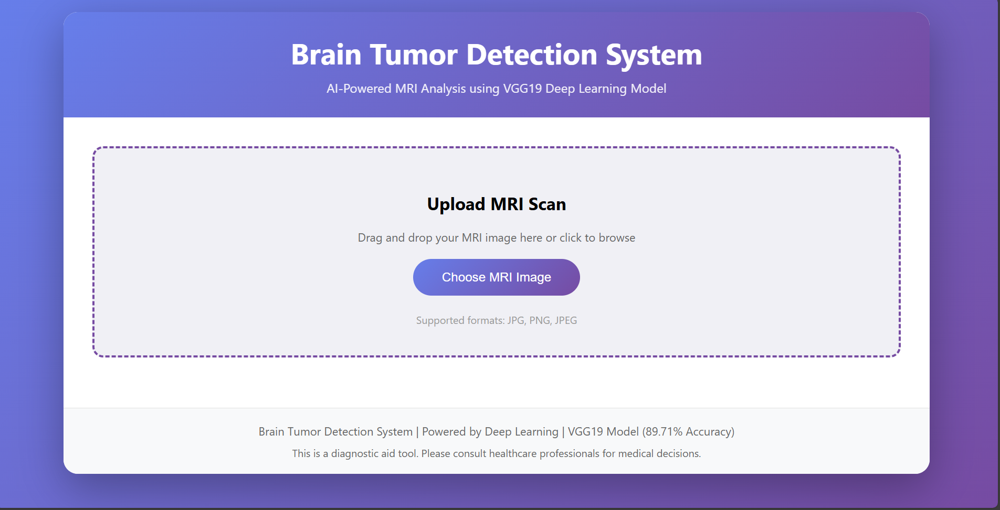
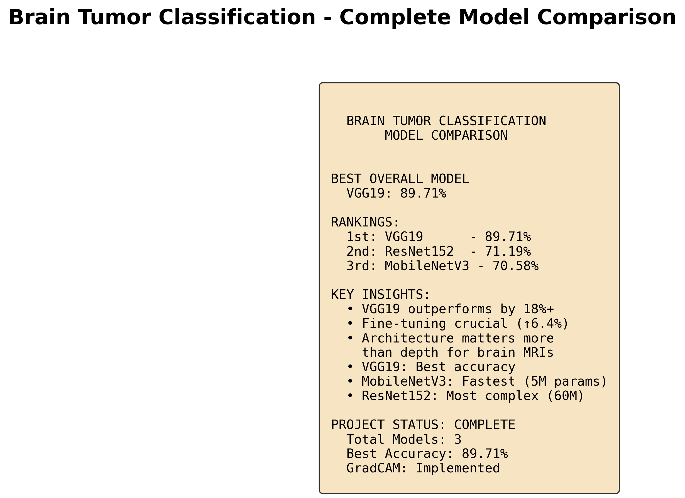

 HEAD
# brain-tumor-detection
AI-Powered Brain Tumor Detection and Classification using VGG19, ResNet152, and MobileNetV3 with GradCAM Visualization - Web Application

{
 "cells": [
  {
   "cell_type": "markdown",
   "id": "1aee5c65-c2f6-42ef-be0f-48b01f72ae62",
   "metadata": {},
   "source": [
    "#  Brain Tumor Detection System\n",
    "\n",
    "AI-Powered MRI Analysis for Brain Tumor Detection and Classification using Deep Learning\n",
    "\n",
    "\n",
    "\n",
    "\n",
    "\n",
    "\n",
    "##  Table of Contents\n",
    "- [Overview](#overview)\n",
    "- [Features](#features)\n",
    "- [Models](#models)\n",
    "- [Demo](#demo)\n",
    "- [Installation](#installation)\n",
    "- [Usage](#usage)\n",
    "- [Results](#results)\n",
    "- [Technologies](#technologies)\n",
    "- [Disclaimer](#disclaimer)\n",
    "- [Contact](#contact)\n",
    "\n",
    "##  Overview\n",
    "\n",
    "This project implements an advanced deep learning system for detecting and classifying brain tumors from MRI scans. The system uses transfer learning with three state-of-the-art CNN architectures and provides explainable AI through GradCAM visualization.\n",
    "\n",
    "**Key Highlights:**\n",
    "-  **89.71% accuracy** with VGG19\n",
    "-  **GradCAM visualization** for tumor localization\n",
    "-  **Web application** with Flask backend\n",
    "-  **Comprehensive model comparison**\n",
    "-  **Automated PDF report generation**\n",
    "\n",
    "##  Features\n",
    "\n",
    "- **Multi-Model Architecture**: Trained and compared VGG19, ResNet152, and MobileNetV3\n",
    "- **Transfer Learning**: Leveraged ImageNet pre-trained weights\n",
    "- **Fine-Tuning**: Achieved 6% accuracy improvement on VGG19\n",
    "- **Explainable AI**: GradCAM heatmaps show tumor location\n",
    "- **Web Interface**: User-friendly Flask web application\n",
    "- **Real-time Predictions**: Upload MRI and get instant results\n",
    "- **PDF Reports**: Downloadable diagnostic reports\n",
    "\n",
    "##  Models\n",
    "\n",
    "### Performance Comparison\n",
    "\n",
    "| Model | Test Accuracy | Parameters | Training Time |\n",
    "|-------|--------------|------------|---------------|\n",
    "| **VGG19** | **89.71%**  | 20.4M | Medium |\n",
    "| ResNet152 | 71.19% | 60M | High |\n",
    "| MobileNetV3 | 70.58% | 5M | Low |\n",
    "\n",
    "### Classification Categories\n",
    "- Glioma\n",
    "- Meningioma\n",
    "- Pituitary Tumor\n",
    "- No Tumor\n",
    "\n",
    "##  Demo\n",
    "\n",
    "### Web Application Interface\n",
    "\n",
    "\n",
    "### GradCAM Visualization\n",
    "\n",
    "\n",
    "### Model Comparison\n",
    "\n",
    "\n",
    "##  Installation\n",
    "\n",
    "### Prerequisites\n",
    "- Python 3.8+\n",
    "- pip\n",
    "- Virtual environment (recommended)\n",
    "\n",
    "### Setup\n",
    "\n",
    "1. **Clone the repository**\n",
    "```bash\n",
    "git clone https://github.com/YOUR_USERNAME/brain-tumor-detection.git\n",
    "cd brain-tumor-detection\n",
    "```\n",
    "\n",
    "2. **Create virtual environment**\n",
    "```bash\n",
    "python -m venv venv\n",
    "source venv/bin/activate  # On Windows: venv\\Scripts\\activate\n",
    "```\n",
    "\n",
    "3. **Install dependencies**\n",
    "```bash\n",
    "pip install -r requirements.txt\n",
    "```\n",
    "\n",
    "4. **Download trained models** (too large for GitHub)\n",
    "- Download models from [Google Drive Link]\n",
    "- Place in `models/` directory\n",
    "\n",
    "##  Usage\n",
    "\n",
    "### Training Models\n",
    "```bash\n",
    "# Train VGG19\n",
    "jupyter notebook notebooks/VGG19_Training.ipynb\n",
    "\n",
    "# Train ResNet152\n",
    "jupyter notebook notebooks/ResNet152_Training.ipynb\n",
    "\n",
    "# Train MobileNetV3\n",
    "jupyter notebook notebooks/MobileNetV3_Training.ipynb\n",
    "```\n",
    "\n",
    "### Run Web Application\n",
    "```bash\n",
    "python app.py\n",
    "```\n",
    "\n",
    "Open browser and navigate to: `http://localhost:5000`\n",
    "\n",
    "### Make Predictions\n",
    "\n",
    "1. Upload MRI scan image\n",
    "2. View real-time prediction\n",
    "3. See GradCAM heatmap\n",
    "4. Download PDF report\n",
    "\n",
    "##  Results\n",
    "\n",
    "### VGG19 Performance\n",
    "- **Test Accuracy:** 89.71%\n",
    "- **Precision:** 89.13%\n",
    "- **Recall:** 88.41%\n",
    "- **F1-Score:** 88.76%\n",
    "\n",
    "### Fine-Tuning Impact\n",
    "- Before: 83.77%\n",
    "- After: 89.71%\n",
    "- **Improvement: +5.94%**\n",
    "\n",
    "### Key Findings\n",
    " VGG19 outperformed deeper architectures  \n",
    " Fine-tuning significantly improved accuracy  \n",
    " Architecture selection matters more than depth  \n",
    " GradCAM provides reliable tumor localization  \n",
    "\n",
    "##  Technologies\n",
    "\n",
    "- **Deep Learning:** TensorFlow, Keras\n",
    "- **Web Framework:** Flask\n",
    "- **Visualization:** Matplotlib, Seaborn\n",
    "- **PDF Generation:** ReportLab\n",
    "- **Image Processing:** OpenCV, Pillow\n",
    "- **Data Analysis:** NumPy, Pandas\n",
    "- **Model Architectures:** VGG19, ResNet152, MobileNetV3\n",
    "\n",
    "##  Disclaimer\n",
    "\n",
    "**IMPORTANT:** This is an educational and research project. It is **NOT intended for clinical use** and has **NOT been approved** by any regulatory authority (FDA, CE, etc.).\n",
    "\n",
    "- This system is for demonstration purposes only\n",
    "- NOT a substitute for professional medical diagnosis\n",
    "- Always consult qualified healthcare professionals\n",
    "- No clinical validation has been performed\n",
    "\n",
    "See [DISCLAIMER.md](docs/DISCLAIMER.md) for complete details.\n",
    "\n",
    "##  Project Structure\n",
    "```\n",
    "brain-tumor-detection/\n",
    "├── app.py                    # Flask web application\n",
    "├── templates/\n",
    "│   └── index.html           # Web interface\n",
    "├── notebooks/\n",
    "│   ├── VGG19_Training.ipynb\n",
    "│   ├── ResNet152_Training.ipynb\n",
    "│   ├── MobileNetV3_Training.ipynb\n",
    "│   └── Final_Model_Comparison.ipynb\n",
    "├── results/\n",
    "│   ├── final_model_comparison.png\n",
    "│   └── model_comparison.csv\n",
    "├── docs/\n",
    "│   └── DISCLAIMER.md\n",
    "├── requirements.txt\n",
    "├── README.md\n",
    "└── .gitignore\n",
    "```\n",
    "\n",
    "##  Future Improvements\n",
    "\n",
    "- [ ] 3D MRI volume analysis\n",
    "- [ ] Ensemble methods combining all models\n",
    "- [ ] Mobile application deployment\n",
    "- [ ] Real-time inference optimization\n",
    "- [ ] Integration with PACS systems\n",
    "- [ ] Multi-modal MRI analysis (T1, T2, FLAIR)\n",
    "- [ ] Tumor size estimation\n",
    "- [ ] Clinical validation studies\n",
    "\n",
    "##  Citation\n",
    "\n",
    "If you use this project in your research, please cite:\n",
    "```bibtex\n",
    "@misc{brain_tumor_detection_2024,\n",
    "  author = {Your Name},\n",
    "  title = {Brain Tumor Detection using Deep Learning},\n",
    "  year = {2024},\n",
    "  publisher = {GitHub},\n",
    "  url = {https://github.com/YOUR_USERNAME/brain-tumor-detection}\n",
    "}\n",
    "```\n",
    "\n",
    "##  Contact\n",
    "\n",
    "**Your Name**\n",
    "- GitHub: https://github.com/AkashGupta-04\n",
    "- Email: guptaaa2904@gmail.com\n",
    "- LinkedIn: https://www.linkedin.com/in/akash-gupta-034a5b305/\n",
    "\n",
    "##  License\n",
    "\n",
    "This project is licensed under the MIT License - see the [LICENSE](LICENSE) file for details.\n",
    "\n",
    "##  Acknowledgments\n",
    "\n",
    "- Dataset: https://www.kaggle.com/datasets/masoudnickparvar/brain-tumor-mri-dataset?select=Training\n",
    "- Pre-trained models: ImageNet\n",
    "- Inspiration: Medical AI research community\n",
    "\n",
    "---\n",
    "\n",
    "** Star this repository if you find it helpful!**\n",
    "\n",
    "Made with for advancing AI in healthcare"
   ]
  },
  {
   "cell_type": "code",
   "execution_count": null,
   "id": "987a2394-0f1d-45f7-b0f3-ae32f92939a6",
   "metadata": {},
   "outputs": [],
   "source": []
  }
 ],
 "metadata": {
  "kernelspec": {
   "display_name": "Python 3 (ipykernel)",
   "language": "python",
   "name": "python3"
  },
  "language_info": {
   "codemirror_mode": {
    "name": "ipython",
    "version": 3
   },
   "file_extension": ".py",
   "mimetype": "text/x-python",
   "name": "python",
   "nbconvert_exporter": "python",
   "pygments_lexer": "ipython3",
   "version": "3.13.5"
  }
 },
 "nbformat": 4,
 "nbformat_minor": 5
}
 2f34e69 (Add gitignore and clean tracked files)
